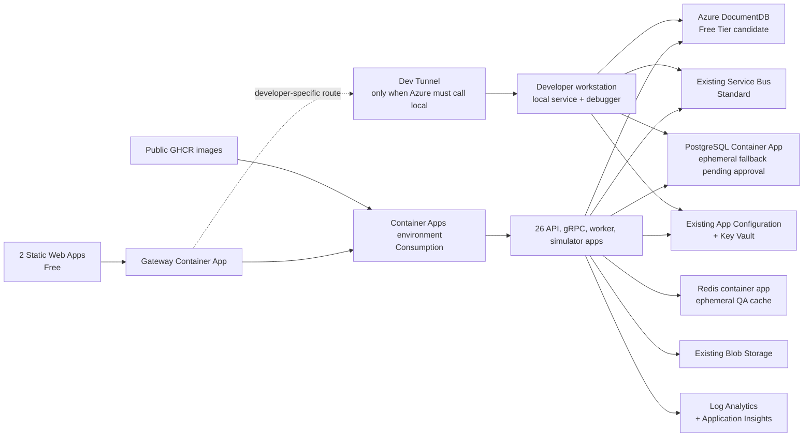

# QA Azure infrastructure — manual-first implementation plan

Status: manual implementation in progress. Shared QA services are live and validated, and the Products + Stock application slice is deployed and healthy. The next slice is Customers + Basket. Bicep remains deferred.

## Goal and boundary

Create a disposable, low-cost QA baseline in Azure so one service can be run and debugged locally against shared remote dependencies. The manual build is the discovery and validation phase. Bicep starts only after the manual topology works and its settings are captured.

This is intentionally a QA design: single region, no SLA, cold starts, public PaaS endpoints with narrow firewalls, disposable caches, and explicit start/stop procedures are accepted. Production-readiness work is out of scope.

## Realized implementation status (2026-08-27)

- Azure CLI is upgraded to 2.89.1 and the DocumentDB extension is installed.
- The subscription budget is USD 5/month with actual-cost alerts at 50%, 80%, and 100% to the nominated contact.
- Month-to-date cost is USD 0.0001289144: USD 0.0001229144 Storage, USD 0.000006 Key Vault, and USD 0 Service Bus.
- Core existing resources and all newly created resources are tagged for QA ownership and expiry. Five older AI resources rejected tag updates while their provider state was non-terminal and remain unchanged.
- Service Bus remains Standard because the application requires topics/subscriptions. The live topology contains 27 queues and 60 topics. `submit-order` and `confirm-shipping_error` are legacy/unmanifested queues and are retained pending investigation.
- App Configuration now contains six `qa`-labeled, non-secret common settings. Legacy null-label settings remain untouched. Normal QA applications use Azure Service Bus with topology creation disabled.
- `eshopacademy-qa` is a running Azure DocumentDB Free Tier cluster in East US with 32 GiB storage and MongoDB 8.0. Credentials are stored in Key Vault. Its smoke test passed ping, unique-index, UUID round-trip, and transaction-abort checks; seven logical databases were bootstrapped.
- `eshopacademy-qa-logs` is live with 30-day retention and a 0.1 GB/day cap. Workspace-based Application Insights `eshopacademy-qa-insights` is linked to it.
- Consumption environment `eshopacademy-qa-env` and internal Redis app `eshopacademy-redis` are live with min 0 / max 1 scaling.
- PostgreSQL app `eshopacademy-postgres` now runs the approved ephemeral fallback. A healthy revision automatically bootstraps `orders` and `orchestration`; both databases were verified with `psql`. It can scale to zero, and test data may be lost between sessions. The rejected Azure Files revision is retained only as deployment history.
- Storage account `eshopacademyqadata` and its 5-GiB `postgres-data` share exist but are not a viable PostgreSQL data path. They are retained pending the persistence decision rather than deleted automatically.
- Products API is deployed at `https://eshopacademy-products-api.yellowforest-6e2fb526.eastus.azurecontainerapps.io` from immutable GHCR image `qa-f955fe3ef7bd9787cd1d3c949be9be5c18bdeb08`. GitHub Actions run `33122161655` built the image without ACR.
- Products revision `eshopacademy-products-api--0000002` is healthy with min 0 / max 1 scaling. Public `/alive`, `/health`, and `GET /api/product` returned HTTP 200; the full health report confirms Azure Service Bus and the `products` DocumentDB database are connected.
- Products uses a system-assigned identity with narrowly scoped App Configuration reader, Service Bus sender, and Cognitive Services user roles. Its DocumentDB connection is an encrypted Container Apps secret sourced from Key Vault at deployment time, and the DocumentDB firewall permits only its observed outbound IP.
- The first Products revision exposed an optional App Configuration cold-start delay. The current manual slice supplies the complete QA settings directly to Container Apps; the identity and reader role are retained while App Configuration startup is corrected before Bicep automation.
- Stock API is deployed at `https://eshopacademy-stock-api.yellowforest-6e2fb526.eastus.azurecontainerapps.io` from immutable GHCR image `qa-83914598eb1eaea1fc33e2efd77bf36e59134b0e`. GitHub Actions run `33123942668` built the image.
- Stock revision `eshopacademy-stock-api--522pkpc` is healthy with min 0 / max 1 scaling. Public `/alive`, `/health`, and `GET /api/stock` returned HTTP 200; health confirms Service Bus and the `stock` DocumentDB database are connected. Its system identity has only Service Bus Data Sender, and it shares the already-whitelisted Container Apps environment outbound IP.

## Current-state summary

The live resource group now contains the nine original resources plus DocumentDB Free Tier, Log Analytics, Application Insights, a Consumption Container Apps environment, a QA data storage account, PostgreSQL, Redis, Products API, and Stock API Container Apps, an Application Insights action group, and one temporary PostgreSQL initializer job. There is no ACR or managed PostgreSQL server.

The application model contains 27 .NET processes and two Vite frontends. It needs seven MongoDB logical databases (`stock`, `customers`, `shipping`, `operations`, `notifications`, `sellers`, and `products`), two PostgreSQL databases (`orders` and `orchestration`), Redis, Service Bus, and Blob Storage.

The machine-readable inventory is in [`.azure/current-state-inventory.json`](../../.azure/current-state-inventory.json).

## Proposed QA topology

## Resource choices and deltas

| Capability | Manual choice | Delta / rationale |
|---|---|---|
| Compute | One Azure Container Apps Consumption environment; one app per .NET executable | Add one environment and 27 apps. HTTP/gRPC apps use min 0, max 1; workers use Service Bus KEDA and min 0. Per-executable deployment is what makes one-service replacement practical. |
| Frontends | Two Azure Static Web Apps Free resources | Add two free sites. The Free plan is sufficient for QA and currently includes 100 GB/month per subscription, subject to its app-size limits. |
| Images | Public GitHub Container Registry packages for the public repository | Avoid ACR's fixed Basic charge. Use immutable commit-SHA tags and public pull for QA images; revisit private registry and managed-identity pull for production. |
| MongoDB | Azure DocumentDB Free Tier in East US, subject to compatibility spike | Add one free 32-GB cluster and create all seven logical databases. This is preferred over Cosmos DB RU free tier because it preserves separate databases. Free Tier has no Entra data-plane authentication, backup/restore, diagnostic logging, HA, or SLA; store its native credential in Key Vault. Fallback: Cosmos DB for MongoDB serverless; serverless does not receive the lifetime free-tier discount. |
| PostgreSQL | PostgreSQL 17 Container App with approved ephemeral storage | Azure Files SMB failed PostgreSQL's POSIX permission requirements. The budget-compatible fallback auto-creates `orders` and `orchestration` on each fresh replica and scales to zero; test data may be lost between sessions. Both databases were verified. A persistent managed PostgreSQL tier is expected to breach the USD 5 cap. |
| Redis | Redis 7 container app with internal TCP ingress | Add one disposable cache app instead of a continuously billed managed Redis. Run min 1 only during test sessions and scale to 0 afterward. Data loss on restart/scale-down is accepted for QA. |
| Messaging | Retain existing Service Bus Standard namespace | Standard is the minimum tier that supports topics. Reconcile the existing 27 queues/60 topics before changing topology. |
| Storage | Retain existing Standard_LRS account | Make `product-images` private, keep shared-key access disabled, and grant identities Blob Data roles. |
| Configuration | Retain App Configuration Free and Key Vault Standard | Remove stale keys, store secrets only in Key Vault, and use App Configuration Key Vault references. The code now supports selecting a QA label; the first Products slice temporarily uses direct settings while its App Configuration cold-start delay is investigated. |
| Observability | One Log Analytics workspace and one workspace-based Application Insights component | Add both with short retention, sampling, and a daily cap. The first 5 GB/month per billing account on the pay-as-you-go log tier is currently free. |
| Network | No VNet, NAT Gateway, or private endpoints in QA | Avoid fixed networking cost and complexity. Use TLS, Entra/RBAC where supported, resource firewalls, Container Apps outbound IPs, and the current developer IP. Record the accepted public-endpoint risk. A later switch to a custom-VNet Container Apps environment is a replacement/migration, not an in-place toggle. |
| Identity | System-assigned managed identity per Container App | Add least-privilege data-plane roles. Local development uses `AzureCliCredential`/`DefaultAzureCredential`; do not distribute cloud secrets. |

Naming must stay within ARM limits. Existing app names fit the 32-character Container Apps limit except `eshopacademy-notification-service`; use `eshopacademy-notifications` for that app. Globally unique resources use an availability-tested suffix, for example `eshopacademyqa<suffix>` for ACR and `eshopacademy-qa-<suffix>` for PostgreSQL/DocumentDB. A DocumentDB cluster name is 3–40 lowercase letters/digits with single internal hyphens and is globally unique.

Validated naming constraints for the new resources are:

| Resource type | Constraint used by the manual plan |
|---|---|
| `Microsoft.App/containerApps` | 2–32 lowercase letters, digits, and hyphens; starts with a letter and ends alphanumeric; unique in the resource group. |
| `Microsoft.ContainerRegistry/registries` | 5–50 alphanumeric characters; globally unique. |
| `Microsoft.DocumentDB/mongoClusters` | 3–40 lowercase letters/digits with single internal hyphens; globally unique. |
| `Microsoft.DBforPostgreSQL/flexibleServers` | 3–63 lowercase letters, digits, and hyphens; no leading/trailing hyphen; globally unique. |
| `Microsoft.OperationalInsights/workspaces` | 4–63 alphanumeric characters and hyphens; starts/ends alphanumeric; unique in the resource group. |
| `Microsoft.Insights/components` | 1–260 characters with the documented exclusions; unique in the resource group. |
| `Microsoft.Web/staticSites` | ARM publishes no specific pattern/length rule; validate the proposed name in the portal/CLI before creation rather than borrowing the App Service `sites` rule. |

## Manual implementation sequence

### 0. Establish cost and ownership guardrails

1. Keep the current `eShopAcademy` resource group and East US region.
2. Add tags to every existing and new resource: `environment=qa`, `workload=eShopAcademy`, `owner=<owner>`, `managed-by=manual`, and `expires-on=<date>`.
3. Create a subscription budget of USD 5/month with notifications at 50%, 80%, and 100%. A budget alerts but does not stop resources.
4. Record the baseline month-to-date cost (currently approximately USD 0.0001) and take an export/screenshot of the resource list before changes.

Exit check: tags and budget alerts are visible, and the pre-change inventory is retained.

### 1. Prepare deployable configuration without provisioning

1. Add a real `QA` configuration path. Do not reuse `Development` in Azure.
2. Change App Configuration loading to select `common:*` and application keys with a `qa` label, with null-label fallback only during migration.
3. Remove tenant IDs and environment names from AppHost helpers. Supply them from deployment configuration.
4. Produce one Linux container image per .NET executable and confirm each image starts locally with its health endpoint.
5. Define a service catalog containing image, port, ingress type, health path, minimum/maximum replicas, Service Bus subscriptions, database, and required RBAC roles.

Exit check: all 27 images build; configuration validation fails clearly when a required endpoint or role is absent.

### 2. Reconcile and harden the existing shared services

1. In App Configuration, export existing keys, classify each as keep/migrate/delete, and create the QA key set. Do not delete old keys yet.
2. Replace direct secrets with Key Vault secrets and App Configuration Key Vault references. Enable Key Vault purge protection before adding final QA secrets.
3. Change `product-images` from public blob access to private and test managed-identity access.
4. Compare Service Bus entities with `docs/plans/production-readiness/messaging-topology.json`. Use one controlled bootstrap identity to create missing entities; normal apps receive sender/receiver roles and run with `CreateTopology=false`.
5. After managed identities and local Azure CLI authentication work, disable Service Bus local/SAS authentication. App Configuration local auth can be disabled after every client uses Entra ID.

Exit check: no application secret is stored as a plain App Configuration value; old keys/entities are merely quarantined, not deleted.

### 3. Create and validate the data tier

1. Create Azure DocumentDB Free Tier in East US and immediately run an automated compatibility smoke test for the MongoDB driver, indexes, transactions, GUID serialization, and every repository query used by the seven services. Configure TLS/SCRAM credentials from Key Vault and `retryWrites=false`; do not mistake paid-tier Entra support for Free Tier support.
2. If the test passes, create the seven logical databases and their collections/indexes. If it fails, stop and select the documented fallback before deploying applications.
3. Use the approved ephemeral PostgreSQL configuration. The attempted Azure Files-backed data directory is incompatible with PostgreSQL permissions. Bootstrap `orders` and `orchestration` on every fresh replica and scale to zero when idle.
4. Run application migrations and seed minimal synthetic data when the first PostgreSQL-backed service is selected. Treat the database as recreatable. If persistence becomes required, stop and approve a paid managed PostgreSQL tier before proceeding.
5. Expose PostgreSQL only inside the Container Apps environment. Local debugging reaches it through a temporary, narrowly scoped tunnel rather than public database firewall rules.

Exit check: database integration tests pass remotely; no production/customer data is copied into QA.

### 4. Add registry and observability

1. Publish public QA images to GHCR from the public repository. Use immutable commit-SHA tags for deployments; a mutable `qa` tag may be a convenience pointer only.
2. Create one Log Analytics workspace and a workspace-based Application Insights component in East US.
3. Set sampling, short retention, and a low daily ingestion cap. Configure alerting on failed revisions, repeated restarts, dead-letter growth, and PostgreSQL availability.

Exit check: an image can be pulled only through authorized identity and a test trace crosses at least two services.

### 5. Create Container Apps and assign identity

1. Create one Consumption environment linked to Log Analytics, without VNet integration.
2. Create the Redis container app first with internal TCP ingress, 0.25 vCPU/0.5 GiB, max 1, and no persistence. Set min 1 while testing and min 0 when parked.
3. Create API and simulator apps with HTTP ingress only where needed. Use internal ingress for service-to-service endpoints; expose only the gateway and externally exercised simulators. Configure gRPC apps for HTTP/2.
4. Create worker apps with no ingress and Service Bus KEDA rules. Set min 0 and max 1.
5. Enable system-assigned identity and assign only the required roles: App Configuration Data Reader, Key Vault Secrets User, Service Bus Data Sender/Receiver, and Storage Blob Data Reader/Contributor as applicable. Public GHCR pulls do not need registry credentials.
6. Set `ASPNETCORE_ENVIRONMENT=QA`, `DOTNET_ENVIRONMENT=QA`, `APPCONFIGURATION=eShopAcademy`, and `APPLICATIONINSIGHTS_CONNECTION_STRING`. Prefer identity and App Configuration references over Container Apps secrets.

Exit check: every app reaches Ready, can access only its required resources, and returns a useful health result after a cold start.

### 6. Deploy in dependency slices

Deploy and smoke-test in this order so failures stay small:

1. Shared dependencies, Redis, observability, and the gateway shell.
2. Products + Stock.
3. Customers + Basket.
4. Orders + Orchestration + Payments + PSP simulator.
5. Shipping + Operations.
6. Sellers + Notifications.
7. Remaining workers and the complete messaging topology.
8. Two Static Web Apps Free sites, with QA gateway/simulator URLs injected at build time.

Do not deploy all 29 processes as one first attempt. Each slice must pass health, database, messaging, and trace checks before the next slice starts.

### 7. Local-only service debugging workflow

For a worker, deactivate or scale the matching QA worker to zero, then run that worker locally with `QA`, Azure CLI authentication, and remote Service Bus/database endpoints. Restore the Azure revision when finished.

For an API or gRPC service:

1. Keep the shared QA endpoint unchanged for other testers.
2. Start the service locally with its normal QA dependencies.
3. Open one authenticated Dev Tunnel port only if an Azure caller must reach the laptop. Current Dev Tunnel limits include 5 GB/user/month and ten tunnels/user.
4. Create a developer-specific gateway revision/label whose target endpoint is the tunnel. Route only the developer's test URL to that revision; never repoint the shared QA gateway globally.
5. Close the tunnel and deactivate the developer revision after debugging.

Prefer calling the local service directly or through a local gateway when possible; it avoids the tunnel and keeps the remote QA baseline stable.

### 8. Acceptance, parking, and rollback

Acceptance requires: two frontend smoke tests, gateway routing, one successful workflow per domain, Service Bus dead-letter checks, all nine databases reachable, image upload/download, trace correlation, and a cost review after 24 hours.

Parking procedure: scale nonessential Container Apps, PostgreSQL, and Redis to zero; close Dev Tunnels; and leave only storage/messaging/configuration resources.

Rollback is revision-based for Container Apps. Preserve the previous healthy revision and image SHA, restore the previous App Configuration snapshot, and roll database changes back only through tested migrations. Do not delete old Service Bus entities or secrets during the first manual pass.

## Cost posture

Expected free or grant-backed items are Static Web Apps Free, Azure DocumentDB Free Tier if compatible, Container Apps within the subscription monthly grant, and the first 5 GB/month of eligible Log Analytics ingestion. Existing F0 AI accounts and App Configuration Free can remain within their quotas.

Current actual Service Bus cost is USD 0 month-to-date, but Standard has a documented subscription-level base charge under normal retail billing. Keep it only while daily actual-cost checks remain within budget. The remaining expected charges are small Key Vault operations, Storage/Azure Files, Container Apps usage above grants, observability ingestion above grants, and network egress. ACR, PostgreSQL Flexible Server, and Azure Managed Redis are excluded to avoid fixed monthly floors.

## Bicep automation phase — deliberately deferred

After the manual environment passes acceptance:

1. Export effective resource JSON and record every portal default that was accepted.
2. Freeze the service catalog, RBAC matrix, names, SKUs, scaling rules, firewall inputs, and App Configuration schema.
3. Produce `.azure/infrastructure-plan.json` for approval.
4. Implement modular Bicep for shared services, data, observability, identities/RBAC, Container Apps, and frontends, with QA parameter files and `azure.yaml` only if the chosen deployment workflow needs it.
5. Validate with Bicep build/lint and Azure what-if against the manual resource group. Adopt or import existing resources without replacement.
6. Switch `managed-by` from `manual` to `bicep` only after a no-destructive-change what-if.

## Approval gate before manual provisioning

Proceed only after approving these defaults:

1. Azure DocumentDB Free Tier as the MongoDB candidate, with Cosmos DB Mongo serverless as fallback.
2. Disposable Redis on Container Apps instead of Azure Managed Redis.
3. Public PaaS endpoints protected by TLS, RBAC, and narrow firewall rules, with no VNet/private endpoints for QA.

## Primary Microsoft references

- [Azure MCP Server overview](https://learn.microsoft.com/en-us/azure/developer/azure-mcp-server/overview)
- [Azure Container Apps pricing and monthly grant](https://azure.microsoft.com/en-us/pricing/details/container-apps/)
- [Azure Container Apps Well-Architected guidance](https://learn.microsoft.com/en-us/azure/well-architected/service-guides/azure-container-apps)
- [Azure DocumentDB Free Tier](https://learn.microsoft.com/en-us/azure/documentdb/free-tier)
- [Azure DocumentDB limitations](https://learn.microsoft.com/en-us/azure/documentdb/limitations)
- [Azure Cosmos DB lifetime free tier](https://learn.microsoft.com/en-us/azure/cosmos-db/free-tier)
- [Stop PostgreSQL Flexible Server compute](https://learn.microsoft.com/en-us/azure/postgresql/configure-maintain/how-to-stop-server)
- [Azure Static Web Apps pricing](https://azure.microsoft.com/en-us/pricing/details/app-service/static/)
- [Azure Monitor pricing](https://azure.microsoft.com/en-us/pricing/details/monitor/)
- [Azure subscription and Dev Tunnel limits](https://learn.microsoft.com/en-us/azure/azure-resource-manager/management/azure-subscription-service-limits)
- [Azure resource naming rules](https://learn.microsoft.com/en-us/azure/azure-resource-manager/management/resource-name-rules)
